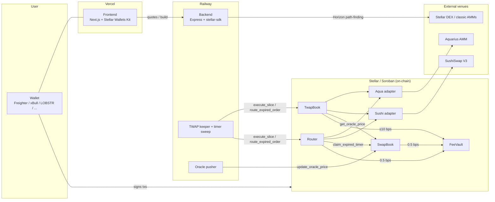

# Ufama — Protocol Architecture

This document describes the system **as deployed** (mainnet addresses in
[DEPLOYMENTS.md](./DEPLOYMENTS.md)). The security analysis lives in
[THREAT_MODEL.md](./THREAT_MODEL.md); operational key roles in
[SECURITY.md](./SECURITY.md).

## Overview

Ufama is a non-custodial swap protocol on Stellar's Soroban platform with
three execution styles sharing one venue layer:

| Style | Contract | Fee | Who executes |
|---|---|---|---|
| Instant swap | `Router` | 0.5 bps (fixed, compile-time) | User signs, one tx |
| P2P limit order | `SwapBook` | 0.5 bps (fixed, compile-time) | Taker fills; optional timer → permissionless keeper routes |
| TWAP | `TwapBook` | ≤ 10 bps (admin-settable, hard-capped on-chain) | Permissionless keeper runs slices |

All protocol fees land in the `FeeVault` contract. Users sign every
transaction in their own wallet; contracts escrow funds and enforce prices
on-chain. No contract has an upgrade entry point — deployed code is
immutable; changes require new deployments users opt into.

> **v1.1 note:** the contracts on `main` are one version ahead of the
> deployed mainnet set — they add `match_and_place` (atomic fill+escrow),
> per-order excluded counterparties, SEP-40 (Reflector) oracle precedence
> with the pushed price as fallback for unconfigured pairs, and
> admin-settable SwapBook/Router fees hard-capped at the deployed
> 0.5 bps. README §"v1.1" has the details; this document's fee and oracle
> claims describe the deployed v1.0 behavior until v1.1 ships.

## System components

## Contracts

Rust, `soroban-sdk` 27, `wasm32v1-none` target. Five production contracts
plus two venue adapters. All take their admin via `__constructor` at deploy
time (atomic with deployment — no initializer front-running window).

### SwapBook — on-chain P2P orderbook

Makers escrow `token_in` into the contract with `place_order`; takers pay
`token_out` to fill. State: `Order(u64)` records in persistent storage, a
bounded per-pair index (`MAX_ORDERS_PER_PAIR = 200`), and oracle prices per
directed pair.

Entry points:

- `place_order(maker, token_in, token_out, amount_in, min_amount_out, expiry, price_mode, max_slippage_bps, auto_route_after)`
  — escrows `amount_in`. Two price modes:
  - **Fixed** (`price_mode = 0`): taker payment is pro-rata against the
    maker's explicit `min_amount_out`, ceiling-rounded.
  - **Oracle** (`price_mode = 1`): taker payment must be within
    `max_slippage_bps` (≤ 1000 = 10%) of the stored oracle fair value; a
    fresh oracle price must exist at placement.
  - `auto_route_after > 0` arms the auto-route timer (see Router below).
- `fill_order` / `partial_fill` — taker pays `token_out` directly to the
  maker (net) and the FeeVault (fee); escrowed `token_in` transfers to the
  taker. The required payment always **rounds up** (`muldiv_ceil` on
  256-bit intermediates) so dust fills cannot round the price to zero. The
  0.5 bps fee also rounds up (minimum 1 stroop) — no fill is fee-free.
- `quote_fill(token_buy, token_pay, amount_pay)` — read-only greedy quote
  from the taker's direction.
- `cancel_order` (maker only) and `expire_order` (permissionless after
  expiry) — both refund remaining escrow to the maker, always.
- `claim_expired_timer(order_id)` — **callable only by the registered
  Router contract** (invoker auth). Transfers the remaining escrow to the
  Router and returns the maker's on-chain price floor `min_out`, derived
  from the order's own terms (pro-rata fixed price, or oracle fair value
  minus slippage). The order is marked `Routed`; if the Router's subsequent
  settlement fails, the whole invocation reverts and the order stays open.

Oracle (used by Oracle-mode orders and by TwapBook):

- `update_oracle_price` — restricted to a dedicated **oracle admin**
  address. Hardened: prices must be strictly positive, and consecutive
  updates may not deviate more than 20% (`MAX_ORACLE_JUMP_BPS`), bounding
  the damage of a compromised oracle key.
- Reads fail if the price is older than ~83 minutes
  (`ORACLE_STALE_LEDGERS = 1000`).
- This is an admin-pushed price; migration to a SEP-40 oracle (Reflector)
  is planned before market orders open to the public (see README gaps).

### Router — multi-venue execution

Holds a venue registry (`venue_id → adapter address`, admin-managed) and no
persistent funds.

- `execute_route(user, token_in, token_out, total_amount_in, min_total_out, segments)`
  — pulls `total_amount_in` from the user, executes each `RouteSegment`
  through its venue adapter, takes the 0.5 bps fee on the **total** output
  (ceiling-rounded), and enforces `net ≥ min_total_out` or the whole
  transaction reverts. Segment amounts must be positive and sum exactly to
  the total. `swap(...)` is the single-segment convenience wrapper.
- `route_expired_order(order_id, segments)` — **permissionless** keeper
  entry point. In one invocation: claims the timer-expired order from
  SwapBook (escrow moves to the Router, the maker's on-chain `min_out`
  comes back), executes the route, deducts the fee, enforces
  `net ≥ min_out`, and pays the maker. A caller gains nothing — proceeds
  always go to the maker — and a bad route reverts atomically, restoring
  the order.

**Push-funds pattern**: for each segment the Router transfers `token_in`
directly to the adapter (invoker auth — the Router is the direct invoker of
the token contract), then invokes
`swap(recipient, token_in, token_out, amount_in, min_out) → i128` on the
adapter, which pushes `token_out` back. No allowances between our own
contracts. An adapter that over-reports its output cannot profit: final
settlement transfers real tokens from the Router's balance, which reverts
if the tokens never arrived.

### TwapBook — time-weighted execution

Makers escrow `total_in` plus a schedule with `place_twap`; a
**permissionless** keeper executes slices via `execute_slice(order_id,
amount_in, segments)` through the same adapter interface (TwapBook keeps
its own venue registry, same shape as the Router's). The contract — never
the keeper — enforces three constraints per slice:

1. **Pace**: cumulative fill ≤ pro-rata schedule + bounded catch-up
   headroom (`pace_tolerance_bps`, ≤ 50%). Early slices fail with
   `AheadOfSchedule`.
2. **Price**: net proceeds (after fee) must clear the maker's fixed limit
   (`limit_num/limit_den`, ceiling-rounded) or, for oracle-bound orders, a
   fresh SwapBook oracle price minus `max_slippage_bps` (≤ 10%).
3. **Cadence**: at least `min_slice_gap` ledgers between slices, and a
   per-slice size cap (`max_slice_in`).

Proceeds stream to the maker every slice, net of the fee. The fee is
**admin-settable** via `set_fee` but hard-capped at compile time
(`MAX_FEE_PER_100K = 100` → 10 bps); `get_fee` exposes it on-chain, so
makers can verify the ceiling and the admin can only ever move the rate
within it. `cancel_twap` (maker) refunds the remainder instantly;
`expire_twap` (permissionless after `end_ledger`) does the same. A
misbehaving keeper can only make execution slower — never worse-priced.
Active orders are capped at `MAX_ACTIVE_ORDERS = 500`.

### FeeVault — fee custody

The destination for all protocol fees. Deliberately minimal: balances are
the token balances themselves (no shadow accounting to drift or strand
fees). `withdraw(token, to, amount)` and `set_admin` are admin-only;
`get_balance` / `get_admin` are public reads.

### Venue adapters

Both adapters implement the same interface the Router/TwapBook dispatch to
(`quote`, `swap`) and are stateless between transactions — they hold no
funds at rest.

- **Aqua adapter**: single-hop `swap_chained` through an admin-registered
  Aquarius pool per pair. Aqua's router pulls funds via a nested
  `transfer(adapter → router)` on the token contract — the adapter
  pre-authorizes exactly that sub-invocation with
  `authorize_as_current_contract`, which is consumed by the **next**
  cross-contract call and therefore sits immediately before the
  `swap_chained` invocation. Output is measured by the adapter's own
  balance delta (robust to venue-side rounding), checked against
  `min_amount_out`, and pushed to the recipient.
- **Sushi adapter**: calls the SushiSwap V3 **pool directly**
  (`pool.swap`) rather than Sushi's router — the router path requires an
  auth entry containing dynamic oracle-hint state no contract can
  pre-authorize, and `swap_prefunded` is gated to factory-authorized
  routers (both verified on mainnet). As the pool's direct invoker the
  adapter passes `require_auth` via invoker auth and pre-authorizes the
  pool's deterministic fund pull. Pairs are admin-registered
  (fee tier + pool address). Same balance-delta measurement and push-back.

### Arithmetic and storage invariants

- All price/fee math uses 256-bit intermediates (`I256`) — no i128
  overflow; division by zero panics with a typed error.
- Everything charged to a user rounds **up** (fees, required payments,
  price floors); everything credited rounds down.
- `overflow-checks = true` in the release profile.
- Persistent entries get TTL extension on write (~30 days); indexes are
  size-bounded (`BookFull` errors rather than unbounded growth).

## Authorization model

| Role | Mechanism | Can | Cannot |
|---|---|---|---|
| Contract admin | `require_auth` on stored `Admin` address | Register/remove venues, set TwapBook fee (≤ 10 bps), set oracle admin, set SwapBook's router, withdraw from FeeVault | Touch escrowed user funds, raise fees above compiled caps, change deployed code |
| Oracle admin | `require_auth` on stored `OracleAdmin` | Push oracle prices within the 20% jump cap | Set prices ≤ 0, jump > 20% per update, affect fixed-price orders |
| Router (as contract) | Invoker auth on `claim_expired_timer` | Claim timer-expired orders — only inside an invocation that settles the maker at their floor | Claim before the maker-chosen timer, settle below `min_out` |
| Keeper | None — permissionless | Trigger TWAP slices, timer routes, expiries | Move funds anywhere but to the maker; violate pace/price/cadence |
| Maker | `require_auth` | Place, cancel own orders | Cancel others' orders |
| Taker | `require_auth` | Fill at or above the order's price terms | Underpay (ceiling math), fill expired orders |

## Backend (Railway)

Express + `@stellar/stellar-sdk` (TypeScript, `backend/src/`). The backend
is a **convenience layer**: it quotes, plans routes, and builds unsigned
transactions. It holds no user funds and cannot spend them — users sign in
their own wallets, and the contracts enforce `min_out` regardless of what
the backend builds.

- `router/engine.ts` — marginal-price-curve split routing across venues;
  blended SDEX+AMM plans when the gain clears `BLEND_MIN_GAIN_BPS`.
- `venues/` — quote adapters: Aqua REST + pool `estimate_swap`, Sushi pool
  `slot0`, Horizon path-finding (Stellar DEX + classic AMMs), SwapBook
  `quote_fill`.
- `services/twap-keeper.ts` — tracks each active TWAP's pro-rata line,
  submits slices, enters an end-game mode near window close so orders
  complete in full. Signs with the keeper key (gas only).
- `services/timer-sweep.ts` — finds timer-expired SwapBook orders and
  submits `route_expired_order`.
- `services/oracle.ts` — pushes SwapBook oracle prices (oracle admin key).
- Integrator API (`/v1` quote/build/send) — API-keyed
  (`INTEGRATOR_API_KEYS`), partner `feeBps` collected on classic legs;
  see [INTEGRATORS.md](./INTEGRATORS.md).

Configuration is env-only (`backend/.env.example`); no secrets in the repo.

## Frontend (Vercel)

Next.js + Stellar Wallets Kit v2 (Freighter, xBull, LOBSTR, Albedo, Hana,
Rabet). Network-guarded signing: the tx's network passphrase must match
`NEXT_PUBLIC_NETWORK_PASSPHRASE`. The frontend displays the quote and the
`min_out` the user is signing; wallets additionally simulate and display
balance changes.

## Fee summary

| Flow | Rate | Where set | Destination |
|---|---|---|---|
| SwapBook fills | 0.5 bps, ceil, min 1 stroop | Compile-time constant | FeeVault |
| Router routes (incl. timer routes) | 0.5 bps on total output, ceil | Compile-time constant | FeeVault |
| TWAP slices | 10 bps default, admin-settable 0–10 bps, ceil | `set_fee`, hard cap compiled | FeeVault |
| Integrator partner fee | per-key `feeBps` | Backend, classic legs only | Partner address |

## Deployment & operations

- Contracts deploy via `stellar` CLI (`scripts/deploy-testnet.sh` for
  testnet); mainnet addresses and registered pools in
  [DEPLOYMENTS.md](./DEPLOYMENTS.md).
- Contracts are **not upgradeable**. Superseded versions are abandoned in
  place and listed as such in DEPLOYMENTS.md.
- Key inventory, storage locations, and blast radius:
  [SECURITY.md](./SECURITY.md).
- Known gaps and the pre-public-launch checklist: README §"Known gaps".
