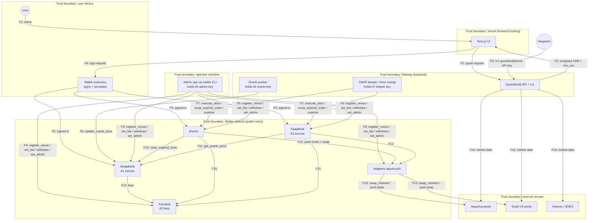

# Ufama — Threat Model

Method: STRIDE, assessed against the dataflow diagram below. Companion
documents: [ARCHITECTURE.md](./ARCHITECTURE.md) (system description),
[SECURITY.md](./SECURITY.md) (key inventory and disclosure policy).

Scope: the Soroban contracts (`contracts/`), the backend services that hold
operational keys, the frontend signing path, and the deployment pipeline.
External venues (Aquarius, SushiSwap V3, Stellar DEX) and wallet software
are modeled as external entities — their internal security is out of scope,
but the trust we place in them is in scope.

## Assets

| # | Asset | Where it lives | Impact if compromised |
|---|---|---|---|
| A1 | Escrowed maker funds (P2P) | SwapBook contract balance | Direct user loss |
| A2 | Escrowed maker funds (TWAP) | TwapBook contract balance | Direct user loss |
| A3 | Accumulated protocol fees | FeeVault contract balance | Protocol revenue loss |
| A4 | In-flight route funds | Router/adapter balances within one tx | Loss only if invariants fail mid-tx (atomic revert otherwise) |
| A5 | Admin key | `stellar` CLI on operator machine | Governance abuse (see T-ADM) |
| A6 | Oracle admin key | Backend host (Railway env) | Bounded price manipulation (see T-ORC) |
| A7 | Keeper key | Backend host (Railway env) | Gas balance only (~20 XLM) |
| A8 | Integrator API keys | Railway env + partners | Unmetered API use, partner fee misdirection |
| A9 | User wallet keys | User devices | Out of scope (user-held); phishing via our UI is in scope |
| A10 | Deploy pipeline (GitHub → Vercel/Railway) | GitHub account, CI | Malicious UI/backend serving users |

## Dataflow diagram

Trust boundaries (dashed groups): the user's device, our hosted
infrastructure (two zones: Vercel and Railway), the operator's machine, the
Stellar network (contracts execute deterministically but are called by
anyone), and external venues.

Data entities crossing boundaries: swap intents and quotes (F1–F3, no
secrets), unsigned/signed transaction XDR (F3–F5 — integrity matters:
`min_out`, contract address, network passphrase), oracle prices (F8),
route segments (F7 — untrusted input to permissionless entry points),
admin invocations (F9), API keys (F6).

## Trust assumptions

1. **Soroban runtime** executes contract code faithfully; token contracts
   (SACs) implement SEP-41 `transfer` semantics honestly.
2. **Registered venue adapters and their registered pools are
   protocol-trusted.** Registration is admin-only; a malicious registered
   venue is equivalent to admin compromise (analyzed at T-ADM-2).
3. **Wallets** display simulated balance changes; users check them for
   large amounts.
4. The **backend is NOT trusted** for fund safety — only for quote
   quality/liveness. Contracts enforce all price floors independently.
5. The **keeper is NOT trusted at all** — its entry points are
   permissionless by design and constrained on-chain.

## STRIDE analysis

Severities assume mainnet with meaningful TVL. "Mitigation" cites the
enforcing code.

### On-chain entry points (boundary: anyone → contracts)

| ID | Threat (STRIDE) | Scenario | Mitigation | Residual risk |
|---|---|---|---|---|
| T-CH-1 | Tampering | Taker underpays a fill via rounding (dust fill rounds price to 0) | `required_payment` is ceiling-rounded, 256-bit intermediates (`swap-book/src/lib.rs` `muldiv_ceil`); amounts validated > 0 | Low |
| T-CH-2 | Tampering | Keeper routes an expired order to a bad venue / worthless min_outs | Maker floor `min_out` computed **on-chain** from the order's own terms and enforced after fees (`Router::route_expired_order`); bad route reverts atomically, order restored | Low |
| T-CH-3 | Tampering | Keeper drains a TWAP with rapid/oversized/underpriced slices | Pace (pro-rata + bounded tolerance), price floor (limit or fresh oracle − slippage, checked on **net** proceeds), cadence gap, per-slice cap — all in `TwapBook::execute_slice` | Low — keeper can only slow execution |
| T-CH-4 | Spoofing | Attacker calls `claim_expired_timer` directly to grab escrow | `require_auth` on the stored Router address; the Router is a contract, so only its own code path (which settles the maker) can satisfy invoker auth | Low |
| T-CH-5 | Tampering | Attacker calls an adapter's `swap` directly to sweep residual adapter balances | Adapters hold no funds at rest (full balance-delta pushed out each swap); an unfunded call has nothing to move and the venue pull fails | Low |
| T-CH-6 | DoS | Grief the book with thousands of dust orders (storage bloat, unbounded index scans) | `MAX_ORDERS_PER_PAIR = 200`, `MAX_ACTIVE_ORDERS = 500` (`BookFull`); placing costs escrow + fees | Medium — a motivated griefer can fill a pair's index with 200 real orders; takers/quotes skip them, but placement is blocked for others until they expire. Accepted for current scale |
| T-CH-7 | DoS | Storage entries expire (TTL) and strand orders | TTL extended to ~30 days on every write (`TTL_EXTEND_TO`); any fill/cancel/expiry re-extends | Low — a fully idle order past 30 days needs restoration before acting; funds are never lost, restoration is permissionless |
| T-CH-8 | Info disclosure | Order flow is public (front-running/MEV) | Inherent to on-chain books. Fills are price-bounded by maker terms; TWAP slices are size/pace-capped, limiting sandwich value; Stellar has no public mempool auctions | Medium — accepted, monitor |
| T-CH-9 | Repudiation | Disputes over what happened | Every state change publishes a typed event (`order placed/filled/claimed`, `twap slice/...`, `fees withdraw`, `oracle update`) | Low |
| T-CH-10 | Elevation | Re-initialization / init front-running | No `initialize` functions — all state set in `__constructor`, atomic with deploy | None |
| T-CH-11 | Tampering | Overflow/precision abuse with extreme amounts | `I256` intermediates with explicit `Overflow` errors; `overflow-checks = true` in release profile | Low |

### Oracle (boundary: Railway → SwapBook)

| ID | Threat | Scenario | Mitigation | Residual risk |
|---|---|---|---|---|
| T-ORC-1 | Spoofing/Tampering | Oracle key stolen (Railway breach): push a fake price, then fill victims' oracle-pegged orders at the fake price | Key is a **dedicated** oracle admin (not the contract admin). Per-update jump capped at 20% (`MAX_ORACLE_JUMP_BPS`); prices must be positive; reads stale after ~83 min; user slippage ≤ 10%. Worst-case single-step distortion ≈ 20% + slippage on oracle-mode orders only; fixed-price orders unaffected | **Medium — the top residual risk.** Sustained key control allows 20% steps every update. Planned: migrate to SEP-40 (Reflector) before public market orders; see REMEDIATION |
| T-ORC-2 | DoS | Oracle stops updating | Reads fail closed (`OraclePriceStale`) — oracle-mode fills and oracle-bound TWAP slices halt; funds remain cancellable/refundable | Low — availability only |

### Admin operations (boundary: operator machine → contracts)

| ID | Threat | Scenario | Mitigation | Residual risk |
|---|---|---|---|---|
| T-ADM-1 | Elevation | Admin key stolen: raise fees, drain vault | TWAP fee hard-capped at 10 bps in code; SwapBook/Router fees are compile-time constants. FeeVault drain = protocol revenue (A3), never user escrow | Medium — bounded to fees + governance |
| T-ADM-2 | Elevation | Admin key stolen: register a **malicious venue adapter**, then "route" through it | Instant swaps: user's own `min_total_out` still enforced — theft requires the victim to sign a bad quote too. Timer routes: maker's on-chain floor still enforced. TWAP: slice price floor still enforced. A lying adapter can't fake settlement (payouts transfer real tokens from Router/TwapBook balances). Remaining vector: a malicious adapter receives pushed segment funds and the settlement check is satisfied from **co-mingled escrow** (TwapBook holds many orders' escrow) — bounded per slice by pace/size caps and detectable immediately via events | **Medium.** Admin key hygiene is the control (see SECURITY.md); venue registrations are on-chain events worth alerting on. Hardware-key or multisig admin planned pre-launch |
| T-ADM-3 | Elevation | FeeVault `set_admin` to attacker | Same key compromise as above; affects A3 only | Low-Medium |

### Backend & integrator API (boundary: internet → Railway)

| ID | Threat | Scenario | Mitigation | Residual risk |
|---|---|---|---|---|
| T-BE-1 | Tampering | Compromised backend serves poisoned quotes/XDR (min_out=0, wrong contract) | Contracts enforce floors the user signs; wallets simulate and display balance changes; network passphrase pinned in frontend | Medium — a user who signs without reading can be routed badly. Planned: frontend-side independent sanity quote (see REMEDIATION) |
| T-BE-2 | Spoofing | Stolen integrator API key | Keys are per-partner (`INTEGRATOR_API_KEYS`), revocable via env; abuse = free quotes + fee redirection for that partner only | Low |
| T-BE-3 | DoS | Quote-spam / keeper starvation | Stateless quotes, horizontal scaling; keeper entry points are permissionless so **anyone** can run a replacement keeper — liveness does not depend on our host | Low |
| T-BE-4 | Info disclosure | Railway env leak (keeper + oracle keys) | Collapses to T-ORC-1 + A7 (gas). No custody keys on Railway | Medium via T-ORC-1 |

### Frontend & supply chain (boundary: GitHub → Vercel/Railway → users)

| ID | Threat | Scenario | Mitigation | Residual risk |
|---|---|---|---|---|
| T-FE-1 | Spoofing/Tampering | GitHub account or CI compromised → malicious UI ships, users sign theft txs | 2FA on GitHub; PR-based workflow; deploys only from `main`; wallet simulation is the user's last line | Medium — standard dapp supply-chain risk. Branch protection + review required (see REMEDIATION) |
| T-FE-2 | Tampering | npm dependency compromise | Lockfiles committed; `cargo audit` in CI for contracts; Dependabot/audit for JS planned | Medium |
| T-FE-3 | Spoofing | Phishing clone of ufama.trade | Domain monitoring; wallets display the contract being invoked | Accepted (industry-wide) |

### External venues (boundary: adapters → Aqua/Sushi)

| ID | Threat | Scenario | Mitigation | Residual risk |
|---|---|---|---|---|
| T-VX-1 | Tampering | Venue returns less than quoted (rounding, fee change, malicious upgrade) | Adapters measure **their own balance delta**, not the venue's claim, and enforce `min_amount_out` per segment; Router/TwapBook re-enforce the user-level floor | Low |
| T-VX-2 | Elevation | Venue exploits the adapter's pre-authorization to pull more than `amount_in` | `authorize_as_current_contract` authorizes exactly one `transfer(adapter → venue, amount_in)` with fixed args, consumed by the next invocation only | Low |
| T-VX-3 | DoS | Venue halts/upgrades incompatibly | Per-segment failure reverts that route; other venues unaffected; venue registry is admin-updatable | Low |

## What a compromised party can and cannot do — summary

| Compromised | Can | Cannot |
|---|---|---|
| Keeper key (A7) | Waste its own gas; pause our keeper (someone else's still works) | Take user funds, degrade any price |
| Oracle key (A6) | Skew oracle ≤ 20%/update; halt oracle-mode flow | Touch fixed-price orders, take escrow directly |
| Backend (Railway) | Serve bad quotes (user must still sign), leak A6/A7 | Spend user funds, exceed on-chain floors users signed |
| Admin key (A5) | Set TWAP fee ≤ 10 bps, swap venue adapters (see T-ADM-2), take accumulated fees | Raise fees past caps, upgrade contracts, directly withdraw user escrow |
| GitHub account (A10) | Ship malicious UI/backend | Change deployed contracts (immutable) |
| Any anonymous caller | Trigger permissionless flows exactly as designed | Everything else |

## Known gaps (tracked, pre-public-launch)

Mirrors README §"Known gaps" with the security-relevant subset:

1. **Reflector (SEP-40) oracle migration** — retires T-ORC-1's residual.
2. **Peer-swap `match_and_place` atomicity** — today's multi-tx plans can
   be raced (economic risk: worse price for the racer's victim is bounded
   by each order's own terms; no fund loss).
3. **Admin key hardening** — hardware key or multisig before TVL grows
   (T-ADM-2).
4. Full remediation plan with owners and sequencing:
   [audit/REMEDIATION.md](./audit/REMEDIATION.md).
